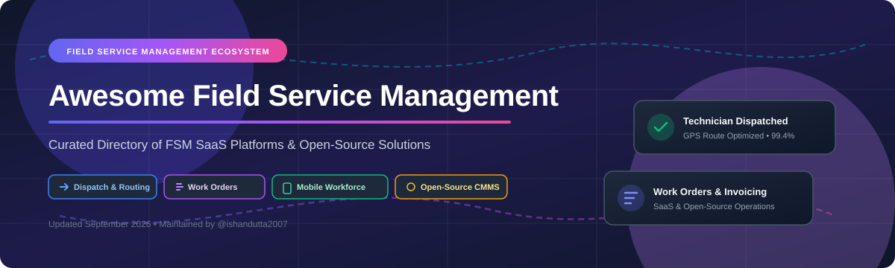

  
  
  

  

# 🛠️ Awesome Field Service Management (FSM)

> A curated directory of top **Field Service Management (FSM)** SaaS platforms and **open-source software** for technician dispatch, job scheduling, work orders, GPS route optimization, mobile workforce management, and customer invoicing.

**Last updated:** September 2026

---

## 📌 Table of Contents

- [🌐 Market Overview & Insights](#-market-overview--insights)
- [🏢 SaaS & Commercial FSM Platforms](#-saas--commercial-fsm-platforms)
- [🔓 Open-Source GitHub Projects](#-open-source-github-projects)
- [💡 Implementation & Architectural Patterns](#-implementation--architectural-patterns)
- [🤝 How to Contribute](#-how-to-contribute)
- [💖 Support & Community](#-support--community)
- [📈 Star History](#-star-history)
- [📜 Disclaimer](#-disclaimer)

---

## 🌐 Market Overview & Insights

> 📊 **Market Size & Fragmentation**: The Global Field Service Management (FSM) market is estimated at **~$5.2 Billion in 2025–2026** and is projected to reach **~$10.8 Billion by 2030** (CAGR ~13.5%). The sector is **highly fragmented**: while enterprise giants (Salesforce) and category unicorns (ServiceTitan, Jobber) control significant share, thousands of specialized regional SaaS platforms and open-source stacks actively serve trades including HVAC, plumbing, electrical, telecom, and facilities maintenance.

---

## 🏢 SaaS & Commercial FSM Platforms

Below is a comparative breakdown of leading commercial Field Service Management SaaS platforms, sorted by **Company Size / Valuation (Descending)**:

| Product | Company Size / Valuation | Starting Price | Free Tier / Trial Limits | Key Focus & Features |
| :--- | :--- | :--- | :--- | :--- |
| **[Salesforce Field Service](https://www.salesforce.com/products/field-service/overview/)** | **~$280B Valuation** `($38B ARR)` | **$50 / user / month** | 30-day free trial *(Full enterprise sandbox & demo)* | Enterprise CRM-integrated dispatch, complex AI scheduling, multi-tier field asset & contract management. |
| **[ServiceTitan](https://www.servicetitan.com/)** | **~$9.5B Valuation** `($700M ARR)` | **$245 / tech / month** | 14-day tailored demo *(Custom sandbox setup on request)* | Built for commercial & large home service contractors (HVAC, plumbing, electrical) with integrated price books & dispatch. |
| **[Jobber](https://www.getjobber.com/)** | **~$800M Valuation** `($100M ARR)` | **$49 / month** | 14-day free trial *(Full features, no credit card required)* | Ideal for small-to-midsize crews: quoting, online client hub, scheduling, mobile app, and payment processing. |
| **[Housecall Pro](https://www.housecallpro.com/)** | **~$600M Valuation** `($100M ARR)` | **$65 / month** | 14-day free trial *(Full feature test drive, instant setup)* | All-in-one platform for residential service pros featuring online booking, instant card payments, and automatic customer follow-ups. |
| **[Skedulo](https://www.skedulo.com/)** | **~$300M Valuation** `($40M ARR)` | **$79 / user / month** | 14-day interactive trial *(Enterprise workforce scheduling demo)* | Mobile workforce & intelligent scheduling platform for enterprise field teams, healthcare, and technical field services. |
| **[Zuper](https://www.zuper.co/)** | **~$150M Valuation** `($15M ARR)` | **$39 / user / month** | 14-day free trial *(Dispatch, work orders, & mobile app access)* | Flexible FSM suite with deep ERP integrations (HubSpot, Salesforce, Zoho), asset maintenance, and field workflows. |
| **[Service Fusion](https://www.servicefusion.com/)** | **~$100M Valuation** `($30M ARR)` | **$166 / month** *(up to 5 users)* | 14-day free trial *(Access to dispatch & mobile features)* | Unlimited user plans available for growing HVAC & electrical service businesses, covering dispatch, invoicing, & GPS tracking. |
| **[Workiz](https://www.workiz.com/)** | **~$90M Valuation** `($20M ARR)` | **$43 / month** | **Free Forever Plan** *(Up to 2 users, basic dispatch)* / 7-day Pro trial | Specialized for lock, carpet, and junk removal service pros with built-in VoIP phone system, scheduling, and job management. |
| **[FieldEdge](https://www.fieldedge.com/)** | **~$80M Valuation** `($25M ARR)` | **$100 / user / month** | 7-day guided demo *(Hands-on trial environment)* | Deep QuickBooks integration for mechanical, plumbing, and HVAC service contractors requiring field price books and billing. |
| **[mHelpDesk](https://www.mhelpdesk.com/)** | **~$50M Valuation** `($15M ARR)` | **$169 / month** *(up to 5 users)* | 14-day free trial *(Full features, no credit card required)* | Work order management, customer portal, offline mobile access, and scheduling for field repair teams. |

---

## 🔓 Open-Source GitHub Projects

The strongest open-source field service and CMMS platforms sorted by **GitHub_Stars (Descending)**:

| Repo / Project | GitHub_Stars | License | Core Capabilities & Description |
| :--- | :---: | :---: | :--- |
| **[frappe / erpnext](https://github.com/frappe/erpnext)** |  | GPL-3.0 | Comprehensive open-source ERP with native maintenance, technician ticketing, stock inventory, and field service workflows. |
| **[traccar / traccar](https://github.com/traccar/traccar)** |  | Apache-2.0 | Leading open-source GPS tracking system for real-time fleet management, technician location tracking, and mobile workforce telemetry. |
| **[osTicket / osTicket](https://github.com/osTicket/osTicket)** |  | GPL-2.0 | Widely adopted open-source ticketing system adaptable for field service call dispatching, customer requests, and issue tracking. |
| **[OCA / field-service](https://github.com/OCA/field-service)** |  | AGPL-3.0 | The official Odoo Community Association suite for field service orders, technician routes, recurring maintenance contracts, and equipment tracking. |
| **[pgRouting / pgrouting](https://github.com/pgRouting/pgrouting)** |  | GPL-2.0 | Geospatial routing engine for PostgreSQL/PostGIS, providing vehicle routing and technician dispatch optimization algorithms. |
| **[openboxes / openboxes](https://github.com/openboxes/openboxes)** |  | Eclipse | Open supply-chain & inventory management system for tracking spare parts, warehouse stock, and equipment dispatching. |
| **[vinaymishraofficial / swiftservice](https://github.com/vinaymishraofficial/swiftservice)** |  | MIT | Open-source mobile-first field service app extension for Frappe/ERPNext featuring GPS check-in/out, spare parts billing, and work orders. |
| **[tecnoteca / openmaint](https://github.com/tecnoteca/openmaint)** |  | AGPL-3.0 | Open-source CMMS and facility maintenance solution for space management, preventive maintenance, and asset field work orders. |

---

## 💡 Implementation & Architectural Patterns

When building or adopting an open-source FSM architecture:

1. **System of Record**: Deploy **Odoo Community + OCA Field Service** or **ERPNext + SwiftService** as the underlying database for inventory, billing, CRM, and customer work orders.
2. **Location & Fleet Tracking**: Integrate **Traccar** for real-time technician GPS tracking and geofencing.
3. **Dispatch & Routing**: Utilize **pgRouting** for spatial route planning and automated schedule optimization.
4. **Mobile Field Access**: Pair the open-source backend with Progressive Web Apps (PWA) or native field apps for offline capability and mobile signatures.

---

## 🤝 How to Contribute

Contributions are welcome! Please follow these guidelines:

1. Fork this repository.
2. Add or update entries in `README.md` keeping formatting consistent.
3. Provide factual product descriptions, direct links, transparent pricing, and repository license information.
4. Submit a Pull Request with a summary of changes.

Check out [Awesome-Awesome-Awesome](https://github.com/ishandutta2007/Awesome-Awesome-Awesome) for more curated lists!

---

## 💖 Support & Community

Thank you for exploring **Awesome Field Service Management**! If this repository helps you evaluate FSM SaaS platforms or open-source field service architectures, please consider supporting the project:

- 🌟 **Star this repository** to help others discover open-source field service tools.
- 🔀 **Fork & Contribute** to submit new field service platforms, tools, or updates.
- 📢 **Share** with service operators, dispatchers, and software engineering teams.
- ☕ **Sponsor**: Support ongoing open-source directory maintenance via [GitHub Sponsors](https://github.com/sponsors/ishandutta2007).

  

---

## 📈 Star History

---

## 📜 Disclaimer

- This is a **community-curated** list — not exhaustive and not an endorsement.
- Field service management software processes sensitive operational, financial, and location data. Verify security, compliance (GDPR/HIPAA/PCI), and SLA agreements independently.
- Product names, logos, and brands are property of their respective owners.

---

  <b>Made with ❤️ for contractors, field service operators, dispatchers, and open-source software teams.</b>

